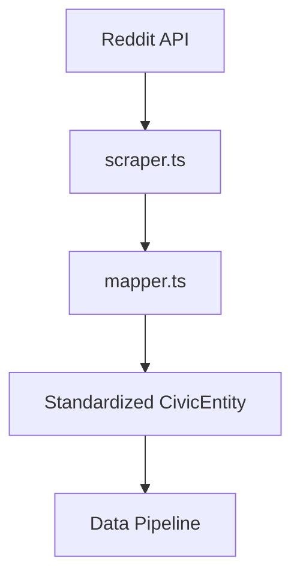

# Reddit Connector for r/cookeville

## Purpose
Ingests discussion posts and comments from the r/cookeville subreddit to create a civic analysis data stream. Automates extraction of user-generated content while applying content validation and schema standardization.

## Key Features
- **OAuth Authentication**: Secure API access via Reddit tokens
- **Pagination Handling**: Full multi-page data retrieval
- **Comment Threading**: Recursive reply extraction
- **Content Filtering**: Removes low-quality posts using length thresholds and spam pattern detection
- **Data Standardization**: Uniform CivicEntity schema output

## Architecture


## File Structure
```
/lib/connectors/reddit-cookeville/
├── config.json          # Source configuration & API credentials
├── index.ts             # Connection points
├── mapper.ts            # Schema transformation
└── scraper.ts           # API handling & content extraction
```

## Configuration
```json
{
  "name": "reddit-cookeville",
  "version": "1.0.0",
  "description": "Reddit connector for r/cookeville posts and discussions",
  "baseUrl": "https://oauth.reddit.com/api",
  "endpoints": {
    "postsNew": "/r/cookeville/new",
    "postsTop": "/r/cookeville/top",
    "postComments": "/comments/{post_id}.json",
    "commentReplies": "/comments/{post_id}/replies/{comment_id}.json"
  },
  "apiCredentials": {
    "clientId": "YOUR_CLIENT_ID",
    "clientSecret": "YOUR_CLIENT_SECRET",
    "refreshToken": "YOUR_REFRESH_TOKEN"
  }
}
```

## Testing
```bash
npx ts-node --esm lib/connectors/reddit-cookeville/test-facebook-connector.ts
```

## Critical Components
| Component | Description |
|-----------|------------|
| `scraper.ts` | Handles OAuth2 auth, pagination, and content extraction |
| `mapper.ts` | Converts Reddit data to CivicEntity format |
| `config.json` | Stores API credentials and endpoints |

## Validation
Ensure credentials are set in environment variables before running tests.